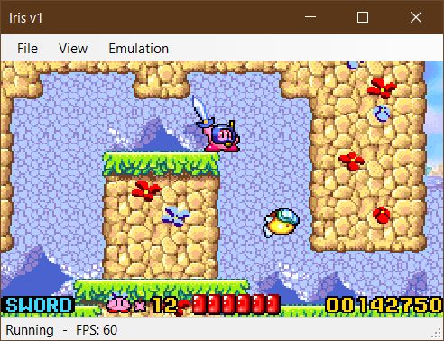

# Iris

Iris is a WIP GameBoy Advance (and Nintendo DS in the future) emulator. The goal is to provide a user-friendly experience with good enough accuracy and speed to play most games without major issues.

    

## Controls

| GBA/NDS | Keyboard | Xbox Controller |
| --- | --- | --- |
| A | A | A |
| B | Z | B |
| X (NDS only) | E | X |
| Y (NDS only) | R | Y |
| L | Q | LB |
| R | S | RB |
| D-Pad | Arrows | D-Pad |
| Start | Enter | Start |
| Select | Space | Back |

## Resources

- The Official Gameboy Advance Programming Manual
- [GBATEK](https://problemkaputt.de/gbatek.htm)
- [TONC](https://www.coranac.com/tonc/text/toc.htm)
- ARM Architecture Reference Manual
- ARM7TDMI Technical Reference Manual
- AGB Aging Cartridge test ROM
- [gba-tests test ROMs](https://github.com/jsmolka/gba-tests)
- [mGBA Test Suite](https://github.com/mgba-emu/suite)
- [ARMWrestler test ROM](https://github.com/destoer/armwrestler-gba-fixed)
- [FuzzARM test ROMs](https://github.com/DenSinH/FuzzARM)
