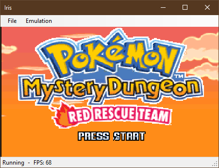
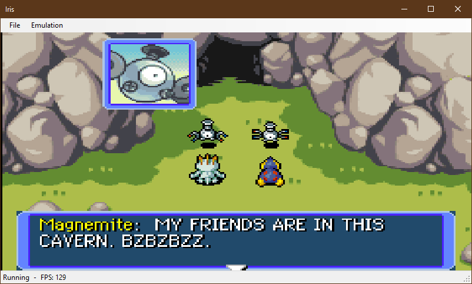

# Iris

Iris is a WIP GameBoy Advance emulator (and maybe DS in the future). I wanted to emulate the GameBoy Advance and needed a project as a playground to learn the C# language so I started this.

## TODOLIST

### GBA

#### Short term

- BIOS LLE
- Missing PPU features used in Pokemon Mystery Dungeon (sprites, etc..)
- Limit framerate to 60 FPS
- Pokemon Mystery Dungeon in playable state
- Load/save states

#### Middle term

- Use OpenGL or Vulkan to make rendering faster (OpenTK or Silk.NET)
- Kirby Nightmare in Dreamland in playable state
- Waitstates
- BIOS HLE: timings
- Add settings dialog
- Add option to choose between BIOS HLE and BIOS LLE
- Add option to enable/disable framerate limiter
- Rudimentary audio

### NDS

#### Short term

- TinyFB test ROM
- Missing ARMv5TE instructions
- Pass ARMWrestler test ROM
- BIOS + Firmware LLE
- All PPU features used in Pokemon Mystery Dungeon
- Pokemon Mystery Dungeon in playable state
- Rudimentary audio

#### Middle term

- ARM946E-S instruction timings

## Compatible games

### GBA

None atm

### NDS

None atm

## Screenshots

  
  

## Resources

- The Official Gameboy Advance Programming Manual
- ARM Architecture Reference Manual
- ARM7TDMI Technical Reference Manual
- [GBATEK](https://problemkaputt.de/gbatek.htm)
- [ARMWrestler test ROM](https://github.com/destoer/armwrestler-gba-fixed)
- [gba-tests test ROMs](https://github.com/jsmolka/gba-tests) (arm.gba and thumb.gba)
- [FuzzARM test ROMs](https://github.com/DenSinH/FuzzARM)
- [TONC demos](https://www.coranac.com/tonc/text/toc.htm) (key_demo.gba)
